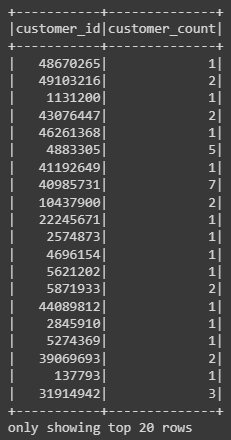
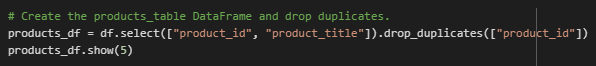
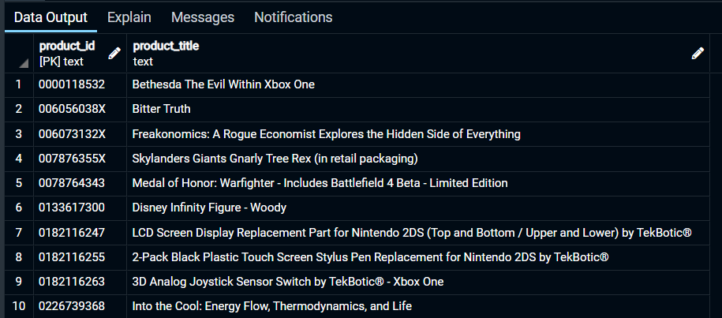

# Amazon Vine Video Game Reviews Analysis

## Overview
---
The purpose of this project is to clean and analyze raw Amazon Reviews data to determine whether reviews written as part of the Amazon Vine program are more likely to be positive.

### What is Amazon Vine?
>Amazon Vine invites the most trusted reviewers on Amazon to post opinions about products to help their fellow customers make informed purchase decisions. Amazon invites customers to become Vine Voices based on the insightful reviews they published on their past purchases and helpfulness of their reviews. Amazon offers Vine members free products that have been submitted to the program by participating selling partners. Vine reviews are the independent opinions of the Vine Voices and the selling partners cannot influence, modify or edit the reviews.

*pulled from https://www.amazon.com/vine/about*

## The Data
---
The raw data used in this project came from an S3 bucket hosted on AWS. The dataset I chose to use for this project was the US video game reviews dataset. 

*The data source* 
https://s3.amazonaws.com/amazon-reviews-pds/tsv/amazon_reviews_us_Video_Games_v1_00.tsv.gz

*Data Schematic*

## Creating Amazon RDS database and connecting to PgAdmin
---
1. Created Amazon RDS database to store data
2. Connected PgAdmin to Amazon RDS
3. Created new database in PgAdmin on Amazon RDS server
4. In PgAdmin, created tables according to `challenge_schema.sql` file
    * `customers_table`, `products_table`, `review_id_table`, `vine_table`

## Extracting the Data
---
In Google Colab
1. Imported and installed Spark and Java
2. Download Postgres driver to connect Spark with Postgres
3. Started Spark Session
4. Loaded data into notebook as a dataframe

*Importing Data* 

*The resulting dataframe*

## Transforming the Data
---
### Once the data was loaded in as a dataframe, it was filtered into four additional dataframes to match the tables in PgAdmin.  
 

### **Review ID DataFrame** 

*Code* 
 
*DataFrame* 

### **Customers DataFrame** 

*Code* 
 
*DataFrame* 

### **Products DataFrame** 

*Code* 
 
*DataFrame* 

### **Vine DataFrame** 

*Code* 
 
*DataFrame* 

 

## Loading the Data
---
### Once all four dataframes were created, they were then written to their corresponding AWS RDS tables.

*Set-up of connection variables* 

*Writing dataframes to AWS RDS tables* 

 
 

### The tables could then be viewed in PgAdmin to verify that they were written in correctly.
 

*Example Query in PgAdmin* 

 

*Example Output* 

 
 

## Analysis of Vine Reviews with PySpark
---
The `vine_table` was used to analyze whether paid vine reviews were more likely to be positive versus unpaid reviews.

### **Vine Table** 

### *Breakdown of `vine_table`* 
* `review_id` = ID of the review
* `star_rating` = what the reviewer rated the game (1-5)
* `helpful_votes` = number of times the review was voted as being 'helpful'
* `total_votes` = total number of times review was voted as 'helpful' or 'not helpful'
* `vine` = whether the review was part of the Vine program (Y or N)
* `verified_purchase` = whether the review was submitted by a verified purchaser of the game

### Two additional dataframes, Vine (paid) and non-Vine (unpaid), were then created with the following criteria:
- Reviews must have >= 20 votes
- At least 50% of votes for each review were 'helpful'

### Using these two new dataframes, the following values were calculated:
1. total number of reviews
2. total number of five-star reviews
3. percentage of five-star reviews

 

## Results
---

### **Paid Vine Reviews**

### **Unpaid Reviews**

## Summary
---
The analysis determined that 51.1% of paid Vine reviews were five-star reviews, versus only 38.7% of unpaid reviews. This indicates a potential bias toward positive reviews in the Vine program- which makes sense since paid reviewers may be more motivated to write positive reviews. 

One major caveat to this analysis is there is a disproportionate number of Vine reviews (n=94) compared to non-Vine reviews (n=40,471), which may skew the data.

